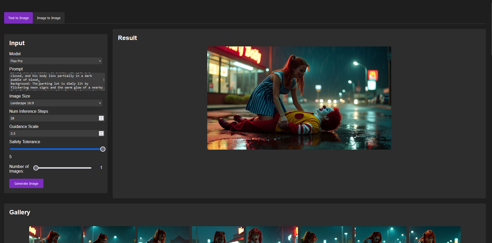

# Fal.ai Flux UI

This project is a web-based user interface for interacting with the Fal.ai Flux image generation models. It allows users to generate images using text prompts or modify existing images, leveraging the power of Fal.ai's Flux models.



## Features

- Text-to-Image generation
- Image-to-Image modification
- Support for multiple Flux models: Flux.1 [dev], Flux.1 [schnell], and Flux Pro
- Adjustable parameters including image size, inference steps, guidance scale, and safety tolerance
- Image gallery to view and manage generated images
- Ability to load settings from previously generated images

## Prerequisites

Before you begin, ensure you have met the following requirements:

- Node.js installed on your local machine
- A Fal.ai API key (sign up at [https://www.fal.ai](https://www.fal.ai) if you don't have one)

## Setup

1. Clone the repository:
   ```
   git clone https://github.com/strykerx/falai-fluxui.git
   cd falai-fluxui
   ```

2. Install the required dependencies:
   ```
   npm install
   ```

3. Create a `.env` file in the root directory of the project and add your Fal.ai API key:
   ```
   FAL_KEY=your_fal_ai_api_key_here
   ```

   Replace `your_fal_ai_api_key_here` with your actual Fal.ai API key.

## Usage

1. Start the server:
   ```
   node server.js
   ```

2. Open a web browser and navigate to `http://localhost:3000` (or whatever port you've configured).

3. Use the interface to generate or modify images:
   - Choose between Text-to-Image or Image-to-Image modes
   - Select a Flux model
   - Enter your prompt and adjust parameters as needed
   - Click "Generate Image" to create your image(s)

4. View your generated images in the gallery section, where you can also load settings from previous generations.

## Important Notes

- Keep your `.env` file secure and never commit it to version control.
- Be mindful of the Fal.ai usage limits and pricing associated with your API key.
- This project is for educational and personal use. Ensure you comply with Fal.ai's terms of service when using their API.

## Contributing

Contributions to improve falai-fluxui are welcome. Please feel free to submit a Pull Request.

## License

This project is open source and available under the [MIT License](LICENSE).

## Acknowledgements

- [Fal.ai](https://www.fal.ai) for providing the Flux image generation models and API.
- All contributors who have helped to improve this project.